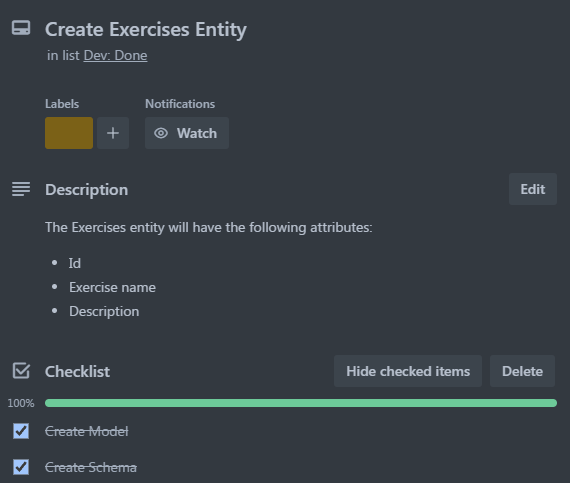

# T2A2: API Webserver

### [Github repository](https://github.com/nlina-0/API-Webserver-2024)


***

### R1. API purpose
The purpose of this application is to provide personal trainers in the fitness industry with a platform to manage their client's progress. Clients can create their own accounts to record their workout sessions. The information recorded includes exercises performed, sets and repetitions done, as well as exercise weight performed for resistance training. Personal trainers can access this data and oversee their client's progress.  Personal trainers will be able to create exercises and provide information about the exercise that a client can access and look up when training on their own. <br></br>

***

### R2. Project management

#### Trello
Using Trello as my task management tool, I defined and allocated what needed to be done for each model and blueprint of the API through checklists. Having an overview of everything that needed to be done allowed me to organise and prioritise tasks within a self directed timeline. 

###### An overview of tasks:


###### Task:





#### Github and Git
The use of git allowed me to log and oversee all details of development at all stages. Using git branch I was able to experiment and debug code without affecting working code.

#### Daily Stand-ups
The daily stand-ups on discord provided me with a platform to channel my thoughts and better understand my development process. It proved to be extremely useful as I was able to read back on previous logs and improve upon things mentioned. Additionally it provided me with reminders of what needed to be done.  
<br></br>

***

### R3. Third-party services, packages and dependencies in app
### Flask
A lightweight python framework for developing web applications or RESTful APIs. Flask provides the most essential components for development making it quick to deploy and test an application. Flask’s minimalist design makes it easy to learn for beginners. Additionally, flask provides extreme flexibility with its modular design, allowing for moveable parts and making code easier to debug. 

Flask is also highly extensible, allowing additional functionality when needed. For example, the app uses flask bcrypt and flask JWT for authentication and authorization. Bcrypt is designed to hash passwords for safe storing, which aids in the security of the app.  Flask JWT allows for the secure transmission of information. Each request made by a user using the API will include a JWT that verifies who the user is providing them access to routes and resources. 

### PostgreSQL
A free and open-source relational database system that is used to manage the storage, retrieval and manipulation of data within the Flask API. It comes with advantageous features that protect data integrity and ensure data consistency. Its flexibility allows for additional features such as psycopg2-binary, the database adapter, to use PostgreSQL in Python.

### SQLAlchemy
An object relational mapper (ORM) for Python. It provides access and management to the PostgreSQL database using Python rather than SQL. 

### Marshmallow
Marshmallow serialises and deserialises data. Also, automatically generates fields for a schema.
<br></br>

***

### R4. PostgreSQL


#### Benefits:

- **Cost effective**: Free and open source tool.
- **Flexibility**: Supports different languages to write database functions such as Python. 
- **Community**: Has a large active community that provides continuous support and development.
- **Object-oriented database features (ORDM)**: Allows for inheritance relationships between tables. Child tables are able to inherit parent attributes which reduces data redundancy.
- **Advanced SQL support**: provides foreign keys, complex queries, and triggers.
- ACID compliant

#### Drawbacks:

- Installation and initial configuration can be challenging for beginners.
<br></br>

***

### R5. SQLAlchemy

SQLAlchemy is an object-relational mapping system (ORM) that allows the use of the Python language to access and manage SQL databases. It provides a streamlined workflow that allows SQL queries to be written in object based programming. This makes code more maintainable by encapsulating database logic in model classes.

#### Features:
- **Mapping**: Provides the ability to structure database tables through python classes and using python objects to create rows of the table.
- **Relationships**: Able to define relationships between objects, such as one-to-many and many-to-many.
- **Data integrity**: Enforces integrity by defining data types in object models.

#### Functionalities:
- **CRUD operations**: Automatically handles create, read, update and delete operations.
- **Querying**: Provides methods to structure queries in python such as where, filter and join statements.  
- **Data validation**: Offers constraints (nullable, unique, default) and validations. 
<br></br>

***

### R6. ERD and relationships

#### Entity Relationship Diagram

Users can record many workout sessions and an exercise can be performed in many workout sessions. The session entity represents the many to many relationship between the user and exercises. The session entity also represents the data about the clients progress.

USERS (user_id, email, name, password)
EXERCISES (exercise_id, name, description)
SESSIONS (session_id, date, set, weight, repetition, user_id, exercise_id)


#### Normalisation
The user and exercise entity did not need to go through any normalisation from the initial design using the normal form rules. The session entity was split into three tables to eliminate the duplication of dates, exercises and session information within the same table.

 A client would only be expected to record one workout session daily.  So, the table ‘session’ was designed to provide a unique identifier for the date the client had their session.

A table was created to represent the exercises performed in a session (‘session_exercises’) which provides a foreign key that links to the exercise table and session table. 

A separate table, called ‘exercise_set’ was created to represent the clients progression of each exercise recorded in the ‘session_exercises’ table. 


<br></br>


#### Crow's Foot notation ERD


<br></br>

***

### R7. Models and Relationships
During development the design and planning phase were revisited multiple times. The ERD below depicts the implemented models.


**Models**:
- User (user_id, name, email, password, is_admin)
- Session (session_id, date, user_id)
- Session_sets (id, set, weight, rep, session_id, user_id)
- Exercise (exercise_id, exercise, description)

#### User Model
The ‘user’ model holds all information about the user, it is used repeatedly throughout the application for authentication and authorisation of the user when attempting certain requests. 

The following code shows a query that identifies the current user and if they’re the admin to be used for authorisation. 
```py
user_id = get_jwt_identity()
stmt = db.select(User).where(User.id == user_id, User.is_admin)
user = db.session.scalar(stmt)
```

The ‘user_id’ is used as a foreign key in the table ‘sessions’ and ‘session-sets’ to identify who owns the session and session-set to ensure the correct authorisation. 

#### Session Model
The ‘session’ model can be used to access data about a session performed on a specific day. It has a relationship with the ‘session_set’ model which allows for a nested schema that displays the session date along with all the session-sets performed in one get request.

#### Session Set Model
The ‘session_set’ records data about an ‘exercise’ performed. ‘Session_set’ has the ‘session’ foreign key to relate back to the ‘session’ date and ‘user’ foreign key. 

#### Exercise Model
The ‘exercise’ model is used to record all exercises and provide a description of the exercise. The client would be able to read the list of exercises and record it in their ‘session_sets’ with a foreign key identifying the exercise. Unfortunately, the relationship between the two tables was unsuccessful in the time given. At the moment the ‘exercise’ table stands alone in the database. Only the administrator (personal trainer) can create, update or delete the exercises. 

An example of how the session set model and exercise model would be joined together to extract the exercise information performed in the session set. 

```py
stmt = db.session.query(Exercise, SessionSet).join(SessionSet, Exercise.id == SessionSet.id).filter(Exercise.id == SessionSet.id)
```
<br></br>

***

### R8. API Endpoints
### Create/Register User
Anyone can create an account.
```py
"/users/register", methods=["POST]
```

###### Body: All fields are required
```py
  "name": "",
  "email": "",
  "password": "" 
```

###### Response
```py
  "email": "",
  "id": ,
  "is_admin": ,
  "name": "",
  "password": ""
```
###### Failed Responses
If there is a missing field:
  ```py
Status code: 400

  "error": "Missing field: 'field'"
```
If a valid email is not enterd:
```py
Status code: 400

  "error": {
    "email": [
      "Not a valid email address."
    ]
  }

```
If an email already exist in the database:
```py
Status code: 409

"message": "Email already exists"
```
If password does not meet required minimum 8 character length:
```py
Status code: 400

"error": {
    "password": [
      "Password must be at least 8 characters long"
    ]
}
```

<br></br>

### User Login
```py
"/users/login", methods=["POST"]
```

###### Body: All fields are required
```py
  "email": "",
  "password": ""
```

###### Response
```py
    "token":
```

###### Failed Responses
If email or password is invalid:
  ```py
Status code: 401

  "error": "Invalid email or password"
```

<br></br>

### Get all Users: Admin only
User must be logged in as admin to perform any 'admin only' endpoints.
```py
"/users", methods=["GET"]
```

###### Header data
```py
Bearer Token: "token"
```

###### Response
```py
[
  {
    "email": "",
    "id": ,
    "is_admin": ,
    "name": 
  }
]
  ```

###### Failed Responses
If user is not admin:
  ```py
Status code: 401

"error": "You must be an admin to access this resource"
```  

  <br></br>

  ### Delete User: Admin only
  Admin needs to enter user_id of the user in http request to delete user. User_id can be found in 'get all users' endpoint.

``` py
"users/<int:id>", methods=["DELETE"]
```

###### Header data
```py
user_id: int
```
```py
Bearer Token: "token"
```

###### Failed Responses
If user is not admin:
```py
Status code: 401

"error": "You must be an admin to access this resource"
``` 
If user_id does not exist:
  ```py
Status code: 404

"error": "Not Found"
``` 

 <br></br>

  ### Update User
  User has to be logged in and can only update their own account. Fields that can be updated are name, email and password.

``` py
"/users", methods=["PUT", "PATCH"]
```

###### Header data
```py
Bearer Token: "token"
```

###### Body: All fields are optional
```py
  "name": "",
  "email": "",
  "password": ""
```

###### Response
```py
  "email": "",
  "id": ,
  "is_admin": ,
  "name": "",
  "password": ""
```

###### Failed Responses
If the user updates to an existing email:
```py
Status code: 409

"message": "Email already exists"
``` 

<br></br>

### Get all Exercises
Available to everyone.
```py
"/exercises", methods=["GET"]
```

###### Response
```py
[
  {
    "description": "",
    "exercise": "",
    "exercise_id": 
  },
  {
    "description": "",
    "exercise": "",
    "exercise_id": 
  }
]
  ```

  <br></br>

### Get one Exercise
Available to everyone. A specific exercise can be requested by enterting the exericse_id in the http request. Exercise_id for each exercise can be found in the 'get all exercises' endpoint.
```py
"/exercises/<int:id>", methods=["GET"]
```

###### Header data
```py
exercise_id: int
```

###### Response
```py
[
  {
    "description": "",
    "exercise": "",
    "exercise_id": 
  },
  {
    "description": "",
    "exercise": "",
    "exercise_id": 
  }
]
  ```
###### Failed Responses
If exercise_id does not exist:
  ```py
Status code: 404

"error": "Not Found"
``` 

  <br></br>

  ### Create Exercise: Admin only
  Only the admin can create an exercise to add to the library of exercises. Both exercise name and description are required. 
```py
"/users", methods=["POST]
```

###### Header data
```py
Bearer Token: "token"
```

###### Body: All fields are required
```py
  "name": "",
  "description": ""
```

###### Response
```py
  "description": "",
  "exercise": "",
  "exercise_id": 
```

###### Failed Responses
If user is not admin:
```py
Status code: 403

"error": "You must be an admin to access this resource"
``` 
If a field is missing:
```py
Status code: 400

"Missing data for required field."
``` 

 <br></br>

  ### Update Exercise: Admin only
``` py
"/exercises/<int:id>", methods=["PUT", "PATCH"]
```

###### Header data
```py
Bearer Token: "token"
```

###### Body: All fields are optional
```py
  "name": "",
  "description": ""
```

###### Response
```py
  "email": "",
  "id": ,
  "is_admin": ,
  "name": "",
  "password": ""
```

###### Failed Responses
If user is not admin:
```py
Status code: 403

"error": "You must be an admin to access this resource"
``` 
If exercise_id does not exist:
```py
Status code: 404

"error": "Not Found"
```

<br></br>

### Delete Exercise: Admin only
  Admin needs to enter exercise_id in http request to delete exercise. Exercise_id can be found in 'get all exercises' endpoint.

``` py
"/exercises/<int:id>", methods=["DELETE"]
```

###### Header data
```py
user_id: int

Bearer Token: "token"
```

###### Failed Responses
If exercise_id does not exist:
```py
Status code: 404

"error": "Not Found"
```

<br></br>

### Get all Sessions
If logged in as admin, admin will get all sessions. If logged in as client user, user will only get sessions owned by them. This endpoint provides users with an overview of all workout sessions completed.
```py
"/sessions", methods=["GET"]
```

###### Header data
```py
Bearer Token: "token"
```

###### Response
```py
[
  {
    "date": "",
    "session_id": ,
    "user": {
      "id": ,
      "name": ""
    }
  },
  {
    "date": "",
    "session_id": ,
    "user": {
      "id": ,
      "name": ""
    }
  }
]
  ```

<br></br>

### Get one Session by ID
Admin can access all sessions. User can only access sessions owned by them. This endpoint allows users to see more information about a specific session. More information includes, exercises performed, sets, weights and repitions completed for each exercise. The session_id which can be found in the 'get all sessions' endpoint is required in the http request. 
```py
"/sessions/<int:session_id>", methods=["GET"]
```

###### Header data
```py
exercise_id: int

Bearer Token: "token"
```

###### Response
```py
{
  "date": "",
  "session_id": ,
  "session_sets": [
    {
      "exercise_name": "",
      "exercise_set": ,
      "id": ,
      "reps": ,
      "weight": 
    }
  ]
]
  ```

###### Failed Responses
  If a user enters a session_id they do not own:
  ```py
Status code: 403

  "error": "You must be the owner to access this resource"
```

If a user or admin enters a session that does not exist:
  ```py
Status code: 404

  "error": "Not Found"
```

 <br></br>

### Create Sessions
  Anyone with an account and is logged in can create a session. This endpoint will update the database with a new session_id with the days date. No body is required. 
```py
"/sessions", methods=["POST"]
```

###### Header data
```py
Bearer Token: "token"
```

###### Response
```py
{
  "date": "",
  "session_id": ,
  "session_sets": [],
  "user": {
    "id": ,
    "name": ""
  }
}
```

###### Failed Responses
If no one is logged in:
```py
Status code: 422

  "msg": "Bad Authorization header. Expected 'Authorization: Bearer <JWT>'"
```

<br></br>

### Delete Session
  Either the admin or owner of the session can delete a session. The session_id must be entered in the HTTP request. Session sets assigned to session will also be deleted.

``` py
"/sessions/<int:id>", methods=["DELETE"]
```

###### Header data
```py
session_id: int

Bearer Token: "token"
```

###### Failed Responses
If the user does not own the session:
```py
Status code: 403

  "error": "You must be the owner to access this resource"
```

If the session does not exist:
```py
Status code: 404

  "error": "Not Found"
```

<br></br>

### Get a Session Set
Admin can access all sessions sets. User can only access sessions sets owned by them. This endpoint allows to retrive all the information about one specific exercise they've completed by entering the session set id in the HTTP request. Session set id's can be found in sessions.
```py
"/session-sets/<int:id>", methods=["GET"]
```

###### Header data
```py
id: int

Bearer Token: "token"
```

###### Response
```py
{
  "exercise_name": "",
  "exercise_set": ,
  "id": ,
  "reps": ,
  "session": {
    "date": "",
    "session_id": 
  },
  "weight": 
}
  ```

###### Failed Responses
If the user does not own the session set:
```py
Status code: 403

  "error": "You must be the owner to access this resource"
```
If the session set does not exist:
```py
Status code: 404

  "error": "Not Found"
```

<br></br>

### Create Session Set
  User has to be logged in. User must own the latest session to create a session set. To be the latest ownder of a session, the user must create one.  
```py
"/session-sets", methods=["POST"]
```

###### Header data
```py
Bearer Token: "token"
```
###### Body: All fields are required
```py
  "exercise_set": "",
  "exercise_name": "",
  "reps": "",
  "weight": ""
```

###### Response
```py
{
  "date": "",
  "session_id": ,
  "session_sets": [],
  "user": {
    "id": ,
    "name": ""
  }
}
```

###### Failed Responses
If no one is logged in:
```py
Status code: 422

  "msg": "Bad Authorization header. Expected 'Authorization: Bearer <JWT>'"
```

If field in body is missing: 
```py
Status code: 400

{
  "error": {
    "field: [
      "Missing data for required field."
    ]
  }
}
```
If user does not own the latest session:
```py
Status code: 403

"error": "You must be the session owner. Create a new session to become session owner."
```

<br></br>

### Update Session Set - double check !!
Admin or user must be logged in. Admin can update any session set, user can only update session set they own. 
``` py
"/session-sets/<int:id>", methods=["PUT", "PATCH"]
```

###### Header data
```py
Bearer Token: "token"
```

###### Body: All fields are optional
```py
  "name": "",
  "description": ""
```

###### Response
```py
  "email": "",
  "id": ,
  "is_admin": ,
  "name": "",
  "password": ""
```

<br></br>

### Delete Session Set
Either the admin or owner of the session set can delete a session set. The session_set_id must be entered in the HTTP request.

``` py
"/session-sets/<int:id>", methods=["DELETE"]
```

###### Header data
```py
session_set_id: int

Bearer Token: "token"
```

###### Failed Responses
If the user does not own the session set:
```py
Status code: 403

  "error": "You must be the owner to access this resource"
```

If the session set does not exist:
```py
Status code: 404

  "error": "Not Found"
```